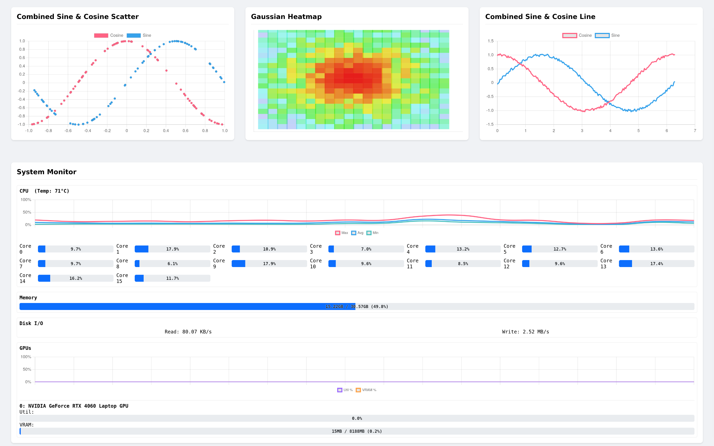

# ScienceUpLink

> Note : This was vibecoded. No shame in it, I needed something that works and is modular quickly. Do not use for sensitive data, the software is provided as is. Feel free to iterate on it.

> License : CC BY-SA 4.0

A lightweight, dependency-free monitoring platform for remote agents, built entirely with Python's standard library. It features a dynamic, configuration-driven web dashboard for real-time visualization of data from any number of remote clients.





## Documntation

Below is a list of ressources that may prove useful
- [Experiment Modules](./Experiment_Module.md)
- [LLM info (give that to an LLM to generate modules, dashboards or widgets)](./LLM_info.md)
- [Platform](./Paltform.md)
- [Web Widget](./Web_Widget.md)

## Core Features

-   **Zero External Dependencies:** Runs on any machine with a standard Python 3 installation. No `pip` or external packages are required for the client.
-   **Dynamic Web Dashboard:** The entire UI is defined by simple JSON files. Create and switch between multiple dashboards on the fly.
-   **Fully Modular:** Add new data sources ("Experiments") and new visualizations ("Widgets") just by adding new files. The core system does not need to be changed.
-   **Real-Time Updates:** Widgets poll for data at configurable intervals, providing a live view of remote systems.
-   **Low Overhead:** The client is a lightweight script that maintains a persistent TCP connection, consuming minimal resources while idle.

## Architecture Overview

The platform uses a "Control Tower" and "Remote Agent" model.

-   **Relay Server (The Control Tower):** A central server that serves the web dashboard and routes commands to clients.
-   **Experiment Client (The Remote Agent):** A script that runs on any remote machine. It connects to the Relay and executes tasks.

The communication flow is simple:
`Web Browser <--> Relay Server (HTTP) <--> Relay Server (TCP) <--> Experiment Client`

## Getting Started

### Prerequisites

-   Python 3.6+

### Installation & Running

1.  **Download the Code:**
    Clone or download this repository to your local machine.

2.  **Run the Relay Server:**
    Open a terminal, navigate to the `relay_server` directory, and run:
    ```bash
    cd relay_server/
    python3 run_relay.py
    ```
    The Relay is now listening on `http://localhost:8000` (for the web UI) and `tcp://localhost:9001` (for clients).

3.  **Run the Experiment Client:**
    Open a *second* terminal, navigate to the `experiment_client` directory, and run:
    ```bash
    cd experiment_client/
    python3 run_client.py
    ```
    The client will connect to the Relay Server. You can run this client on any other machine by changing the `RELAY_HOST` in `client/core.py`.

4.  **View the Dashboard:**
    Open your web browser and navigate to **`http://localhost:8000`**. You will see the default dashboard and can select others from the dropdown menu.

## How It Works: The Three Core Modules

This platform is extended by creating and modifying three types of files:

1.  **Dashboards (`/relay_server/dashboards/*.json`)**
    These JSON files are the blueprints for the UI. They define which widgets to display, their titles, refresh rates, and what data they need.

2.  **Experiment Modules (`/experiment_client/modules/*.py`)**
    These are the backend data providers. Each Python file defines a `handle(endpoint)` function that receives a command, performs an action (like reading a system file), and returns a JSON-serializable dictionary.

3.  **Widgets (`/relay_server/relay/static/widgets/*.js`)**
    These are the frontend visual components. Each JavaScript file defines a class that knows how to render a specific type of data (e.g., as a line chart, a heatmap, or a table). They can even include their own CSS for custom styling.

## How to Extend the Platform

Creating a new visualization is a simple three-step process:

1.  **Create an Experiment Module:**
    -   Create a new `.py` file in `experiment_client/modules/`.
    -   Implement the `handle(endpoint)` function to return the data you want to visualize.

2.  **Create a Widget Module:**
    -   Create a new `.js` file in `relay_server/relay/static/widgets/`.
    -   Implement a class with a `constructor` to set up the HTML/Canvas and an `update(data)` method to render the data from your experiment.
    -   Optionally add a `static css` property to style your widget.

3.  **Update a Dashboard:**
    -   Open a `.json` file in `relay_server/dashboards/`.
    -   Add a new object to the `widgets` array, setting the `"type"` to your new widget's filename and configuring the `"dataSource"` to point to your new experiment module.